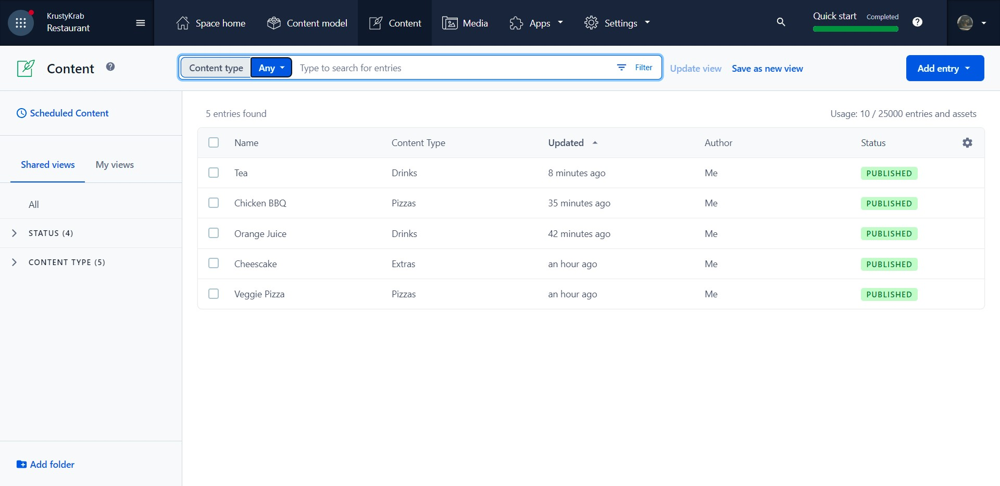
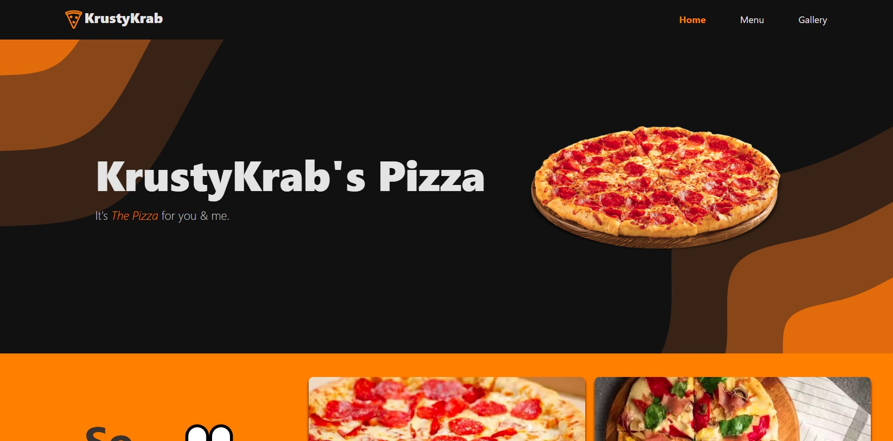

# Restaurant Demo Website

> Who doesn't like Pizza?

See it live [Here!](https://pizza-salta3.netlify.app/)

This website was made for me to learn TailwindCSS and I picked up Framer Motion along the way, and then added Contentful as a Headless CMS.

```
Status: WIP
```
---
Dashboard on Contentful:



---
Front end:



---

### Technologies Used: 

1. [TailwindCSS](https://tailwindcss.com/)

2. [Framer Motion](https://www.framer.com/motion/)

3. [React Router](https://reactrouter.com/) 

4. [Contentful](https://www.contentful.com/)